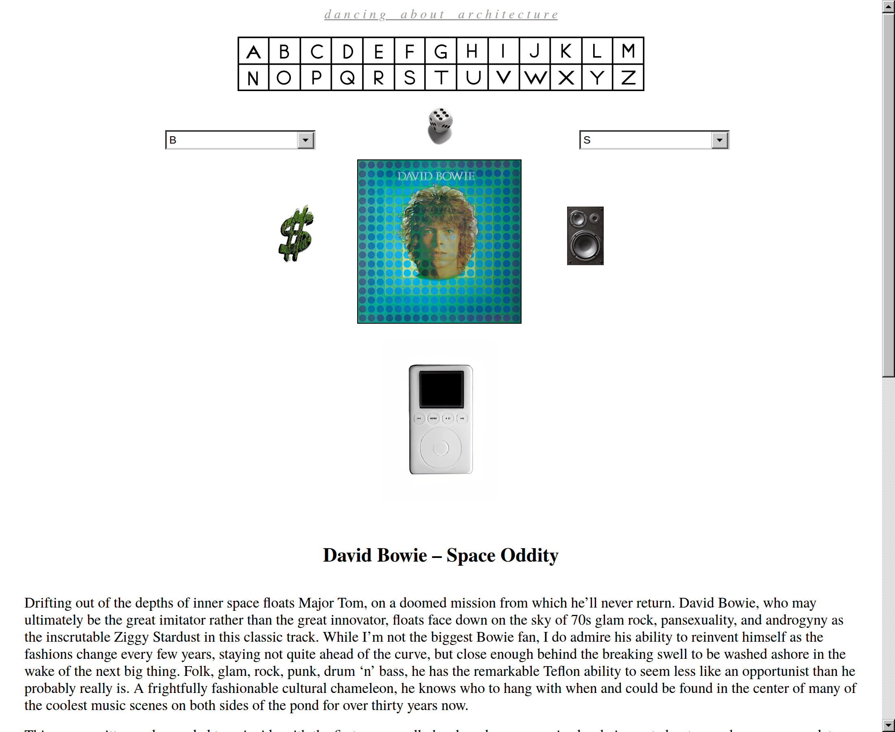

# Dancing About Architecture

*Dancing About Architecture* is a website and accompanying podcast that hails from an earlier era of the internet.

It is many things. A deeply personal love letter to the power of music. An autobiography. An art project. A music review site.

It is also for me a reminder of an earlier era of the internet. Back when sites were made by hobbyists. Made by hand, a little crude but full of love.

Over time, the internet has been terraformed by large companies and social media and there have been amazing things that have come with progress but it has also made it hard for sites like *Dancing About Architecture* to survive. Many of those independent, passionate, personal websites have slowly gone offline. They've been replaced with Russian spam gambling sites or domain purchasing site.

*Dancing About Architecture* was one of those sites. Its original home was **hypercubism.com**. You can still [visit pieces of it in the Internet Archive](https://web.archive.org/web/*/http://www.hypercubism.com/), but the archive did not capture everything.

It was not a famous site, but the people who found it were often very moved by it. It's hard not to find it moving.

I just so happen to know the maker of this site personally, and I just so happen to want more people to be able to experience it if they so choose. So I asked him for the original site, and he graciously obliged.

That is what [dance.archi](https://dance.archi/) is. A home for it again.

## The vision

I see this project as a restoration of sorts, like when people digitize old movies from film for a Blu-ray release. It's always a bit of an editorial process. Do you remove the film grain? Do you remove dust and scratches? Do you fix the colors?

Film fades. Dust and scratches accumulate. The most faithful scan of an old print is not necessarily the most accurate capture of what it was like to experience that film in the theater.

A good re-release keeps the film grain. It doesn't try to make an old movie feel like it was released yesterday, or make editorial decisions. But it does remove dust and scratches, and fix up the colors a bit.

I see the work of putting this site online and maintaining it similarly. My job is to keep the film grain and preserve what it felt like to see the movie in the theater.

## The execution

I want the site to *feel* the way it did to browse in the early aughts. It was built with Adobe GoLive, and modern browsers don't always interpret its code the way browsers did back then. Part of the work is repairing those differences: restoring old spacing, fixing broken behavior, and adding bits and pieces of code to bring that feeling back.

I've kept the writing largely as it was, with occasional corrections. You will notice little things throughout the site that remind you it's from an older era of the web. References to Internet Explorer. Things that are no longer current. Some references and attitudes that are a little out of date. Those are part of its history, too.

The internet around the site has changed as well. Many of the bands and artists it links to once had their own websites, and those sites have since disappeared. Where possible, I've replaced broken links with [Wayback Machine](https://web.archive.org/) copies from as close to the site's original era as I can find.

The restoration is still a work in progress. There are things to mend, and things to leave a little crude.

[Come on in.](https://dance.archi/)
